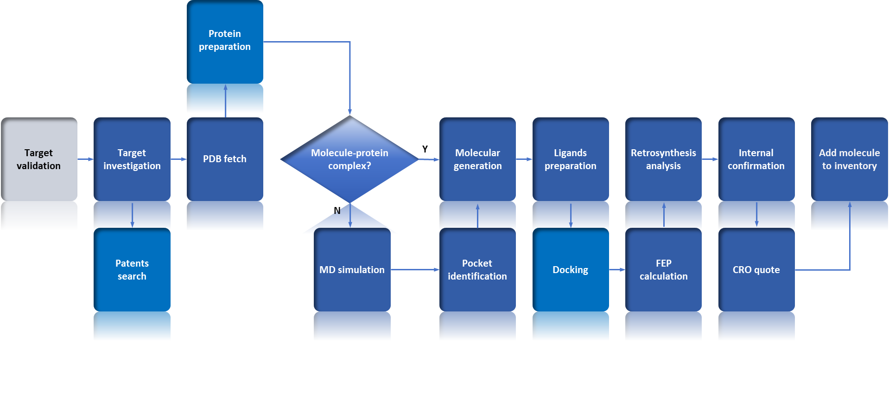

# Gnexus

[English](README.md) | [简体中文](README-zh.md) 

Gnexus is an integrated multi-agent skills system designed for AI-driven drug discovery (AIDD), covering the full computational discovery workflow from target protein investigation, structural analysis, pocket-based molecular generation, docking, molecular dynamics (MD) simulations, to high-accuracy FEP free-energy calculations. Rather than functioning as isolated tools, the Agents act as clearly specialized “professional AI roles” that can collaborate with one another: they automatically hand off tasks within a unified framework, share intermediate results, and interact with team members through natural language and structured information. This enables a modularized, automated, and collaborative research workflow, advancing drug discovery from “human-driven” to “agent-collaboration-driven.”

<div align="center">

</div>

## Installation

#### 1. Clone the project

```bash
git clone https://github.com/Gewu-Intelligence/Gnexus
cd Gnexus
```

#### 2. Create a conda environment

```bash
conda env create -f environment.yml
conda activate gnexus
```

#### 3. Install OpenCode

```bash
npm install -g opencode-ai
## or
curl -fsSL https://opencode.ai/install | bash
```
You can also install it using other methods described in the [OpenCode docs](https://opencode.ai/docs).

After that, you should be able to launch the OpenCode TUI (terminal user interface) from your shell:

```bash
opencode
``` 
or start a local web server:
 
```bash

OPENCODE_SERVER_USERNAME=who OPENCODE_SERVER_PASSWORD=secret opencode web --hostname 127.0.0.1 --port 4059
```

Open a browser and go to [https://localhost:4059]. Log in with the corresponding username and password to access OpenCode’s web service.

For the LLM model, Zhipu AI GLM-4.7 is recommended.

> For LAN access, replace 127.0.0.1 with 0.0.0.0.

#### 4. Other software (optional)

1. Gromacs
    
If you plan to use GROMACS for MD simulations, make sure gmx or gmx_mpi is correctly set in your environment variables (PATH). Please refer to the[GROMACS Installation guide](https://manual.gromacs.org/documentation/current/install-guide/index.html)
```bash
# vi ~/.bashrc
# settings of MPI environmnet
# settings of cuda if it is required 
source $GMX_PATH/install/bin/GMXRC
gmx_mpi --version
```

2. ADMET
To use ADMET prediction, please install [admet-ai](https://github.com/swansonk14/admet_a)
```bash
conda create -y -n admet_ai python=3.12
conda activate admet_ai
pip install admet-ai
```

3. Retrosynthesis
For retrosynthesis analysis, use the team-developed [RXNGraphormer](https://github.com/licheng-xu-echo/RXNGraphormer)工具
```bash
conda create -n rxngraphormer python=3.10
conda activate rxngraphormer
git clone -b pytorch2 https://github.com/licheng-xu-echo/RXNGraphormer.git
cd RXNGraphormer/

pip install torch==2.2.1 --index-url https://download.pytorch.org/whl/cu121
pip install pyg_lib torch_scatter torch_sparse torch_cluster torch_spline_conv -f https://data.pyg.org/whl/torch-2.2.0+cu121.html
pip install rdkit==2024.3.2 ipykernel pandas python-box OpenNMT-py==1.2.0 torchdata==0.7.1 torch_geometric rxnmapper localmapper transformers==4.30.0 numpy==1.26.4 scikit-learn
pip install .
```